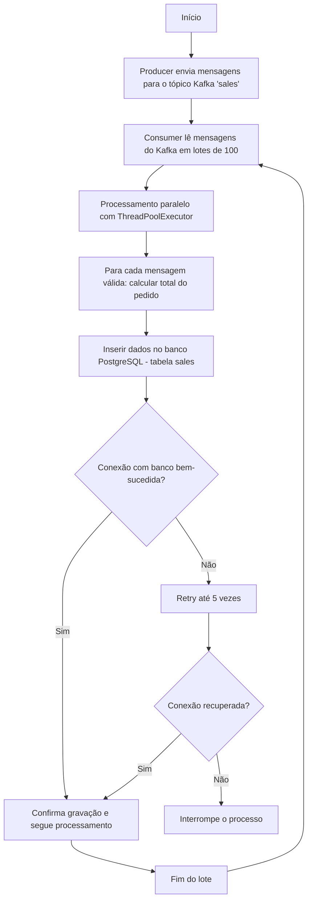

#  Projeto: Processamento Paralelo de Vendas em Tempo Real

##  Contexto

Processamento em tempo real de vendas capturadas através de um tópico Kafka, cálculo do valor total de cada pedido, e armazenamento dos dados em um banco relacional PostgreSQL.

Desenvolvido como solução para o desafio técnico de **Processamento Paralelo de Vendas em Tempo Real com Python, Kafka e Banco Relacional*
*.

---

##  Tecnologias Utilizadas

- Python 3.8+
- Apache Kafka
- PostgreSQL
- kafka-python
- psycopg2
- unittest

---
##  Fluxograma do Projeto




##  Configuração do Ambiente

### 1. Instalar dependências

```bash
pip install -r requirements.txt
```

### 2. Subir o ambiente com Docker

```bash
docker-compose up -d
```

### 3. Configurar variáveis de ambiente

(opcional, senão assume valores padrão)

- DB_HOST
- DB_NAME
- DB_USER
- DB_PASS

---

## 📜 Criação da Tabela `sales`

```sql
CREATE TABLE sales (
    order_number BIGINT PRIMARY KEY,
    total_value NUMERIC(10,2) NOT NULL,
    processed_at TIMESTAMP NOT NULL
);
```

---

##  Execução do Projeto

### 1. Iniciar o produtor de mensagens (mock).

```bash
.venv\Scripts\activate.bat 
```

```bash
python src/kafka_producer_mock.py
```

### 2. Iniciar a Aplicação.

```bash
.venv\Scripts\activate.bat 
```

```bash
python src/main.py
```

---

##  Paralelismo

- Utilizado `ThreadPoolExecutor` para processamento paralelo das mensagens em lotes.
- Cada lote contém 100 mensagens.
- O paralelismo é feito dentro de cada lote para melhorar a eficiência do processamento.

---

##  Tratamento de Erros

- Mensagens malformadas são registradas em log e ignoradas.
- Falhas no banco de dados tentam reconexão até 5 vezes. Após isso, o processo é interrompido.

---

##  Testes

Testes implementados utilizando `unittest`:

- Teste da função `process_message`.

Executar todos os testes:

```bash
python -m unittest discover tests
```

---

##  Sobre o Paralelismo Utilizado

Para o processamento paralelo dentro dos lotes, foi utilizada a estratégia de **ThreadPoolExecutor** do módulo `concurrent.futures` do Python.

A escolha se deu porque:

- **Contexto de I/O**: O processamento principal envolve ler mensagens do Kafka e realizar inserções no banco de dados, operações que são limitadas por tempo de espera (I/O Bound).
- **Baixo Overhead**: Threads em Python são mais leves que processos, ideais para tarefas I/O-bound sem sobrecarregar o sistema.
- **Simplicidade de Implementação**: `ThreadPoolExecutor` permite paralelizar a execução com poucas linhas de código, mantendo o código limpo e fácil de manter.
- **Escalabilidade**: Aumentar o número de workers (threads) é simples, permitindo otimizar o desempenho em cenários de alta carga.

Essa abordagem é eficiente e adequada para o contexto do desafio, onde o gargalo principal não é CPU-bound e sim o tempo de resposta dos sistemas externos (Kafka e Banco de Dados).


#  Entregáveis

- Código-fonte.
- README explicativo.
- DDL da tabela.
- Testes automatizados.
